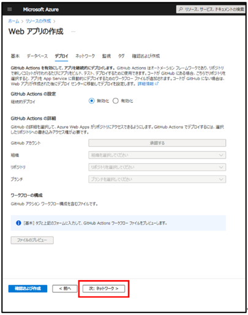
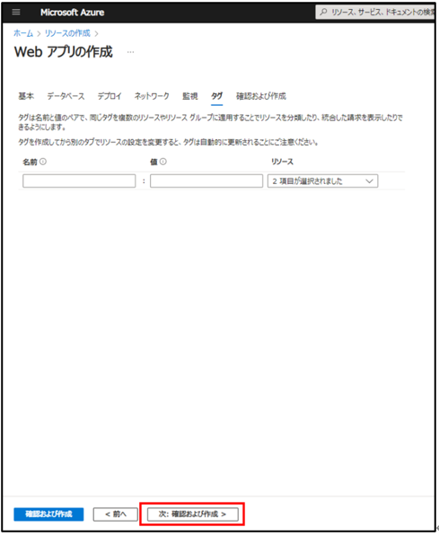
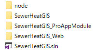
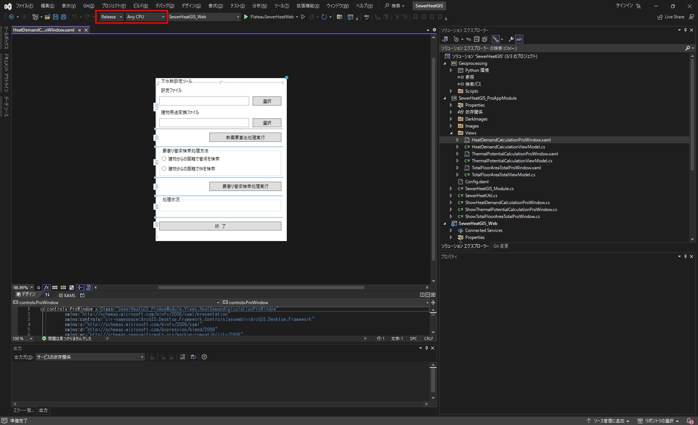
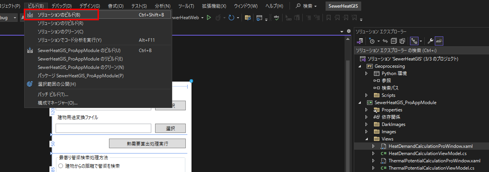
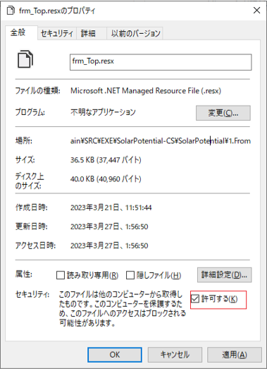
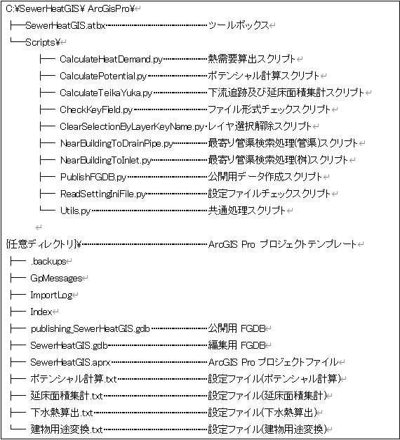
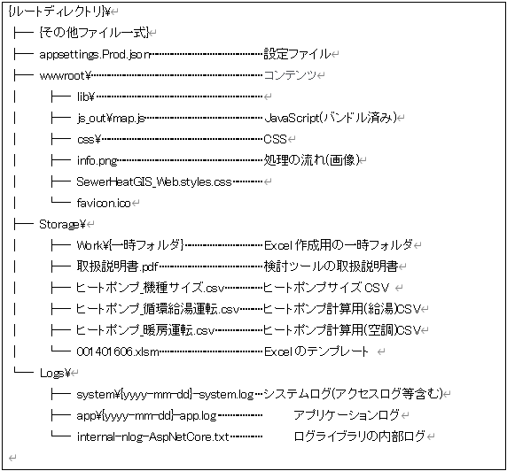

# 環境構築手順書

# 1 本書について

本書では、下水熱ポテンシャルマッチングシステム（以下「本システム」という。）の利用環境構築手順について記載しています。本システムの構成や仕様の詳細については以下も参考にしてください。

[技術検証レポート](https://xxxx)

# 2 動作環境

本システムの動作環境は以下のとおりです。

| 項目 | 最小動作環境 | 推奨動作環境 | 
| - | - | - | 
| OS | Microsoft Windows 10 または 11 | 同左 | 
| CPU | Intel Core i3以上 | Intel Core i5以上 | 
| メモリ | 8GB以上 | 32GB以上 | 
| ディスプレイ解像度 | 1024×768以上 |  1080ｐ  | 
| ブラウザー       | Google Chrome バージョン 115 以降 Microsoft Edge バージョン 115 以降 Mozilla Firefox バージョン 117 以降 Mozilla Firefox バージョン 115 (ESR) Safari バージョン 16 以降 |  同左                            | 
| ネットワーク       | ライセンス認証にネットワーク環境が必要 背景地図を表示させるために以下のURLを閲覧できる環境が必要 ・背景の標準地図 https://services.arcgisonline.com |  同左                            | 

# 3 設定手順
## 3-1 インストール手順
ArcGIS Pro3.1.3のインストールを実施します。

[こちら](https://github.com/Project-PLATEAU/Sewage-thermal-matching-system/releases/)
からアプリケーションをダウンロードします。

ダウンロード後、zipファイルを右クリックし、「即時解凍」を選択することで、zipファイルを展開します。

展開されたフォルダ内の「01_ArcGISProツールボックス」「02_ArcGISProアドイン」「03_ArcGISProプロジェクトテンプレート」を適切に配置・実行することで、アプリケーションが起動します。

「モジュール\01_ArcGISProツールボックス\SewerHeatGIS」フォルダを「C:\」に
配置します。

※配置後、「C:\SewerHeatGIS\ ArcGisPro」となることを確認してください。

「モジュール\02_ArcGISProアドイン\SewerHeatGIS_ProAppModule\SewerHeatGIS_ProAppModule.esriAddinX」をダブルクリックして、
Esri ArcGIS アドイン インストール ユーティリティを起動します。

「アドインのインストール」ボタンをクリックします。

インストールが完了すると通知が表示されます。

「モジュール\03_ArcGISProプロジェクト\ArcGisPro」を任意のフォルダに配置してください。

## 3-2 Webの構築

ArcGIS OnlineおよびAzure App Serviceの契約が必要となります。

Azure Portalにアクセスし、「サインイン」からログインする。

[URL] https://azure.microsoft.com/ja-jp/get-started/azure-portal

「リソースの作成」をクリックする。

Webアプリの「作成」をクリックする。

「基本」画面で下記を参考に各情報を入力し、Windowsプランを「新規作成」する。

  サブスクリプション      ：デフォルト

  リソースグループ        ：{任意}

(リソースグループがなければ新規作成してください)

  名前                    ：{任意}※

https://{名前}.azurewebsites.netがWebのURLになります。

 公開                    ：コード

  ランタイム スタック     ：.NET 6(LTS)

  オペレーティングシステム：Windows

  地域                    ：Japan West (またはJapan East)

※「新しいApp Serviceプラン」の名前は任意です。

価格プラン(Standard S1)を選択し、「次：データベース>」をクリックする。

データベースの作成はデフォルト(チェック無し)で、「次：デプロイ>」をクリックする。

全てデフォルトで「次：ネットワーク>」をクリックする。

全てデフォルトで「次：監視>」をクリックする。

Application Insightsを有効にする「いいえ」を選択し、「次：タグ>」をクリックする。

デフォルトで「次：確認および作成>」をクリックする。

内容を確認の上、「作成」ボタンをクリックする。

「デプロイが進行中です」のメッセージが「デプロイが完了しました」に変更となった
ことを確認し、「リソースに移動」をクリックする。

左メニュー「デプロイセンター」をクリックする。

FTPS資格情報タブをクリックし、以下の情報を確認する。

FTPSエンドポイント：{自動生成}

FTPSユーザー名：{自動生成}

パスワード：{自動生成}

## 3-3 ArcGIS Onlineの初期設定

・ArcGIS Onlineにアクセスし、「サインイン」からログインする。

[URL] https://www.arcgis.com/index.html

ログイン後、画面上部の「コンテンツ」タブをクリックする。

「新しいアイテム」をクリックする。

「アプリケーション」をクリックする。

「Webマッピング」を選択し、URLにAzure App ServiceのURL(https://{名前}.azurewebsites.net)を入力して、「次へ」をクリックする。

各情報を入力し、「保存」をクリックする。

  タイトル：{任意}	(例) 下水熱UC

  フォルダ：{任意}	(例) SewerHeatGIS

  タグ    ：{任意}	(例) production

  サマリー：{任意}	(例) 下水熱UC公開用のアプリケーションキー

アプリケーションキーの作成後、右上の「設定」ボタンをクリックする。

「信頼できるとしてマーク」をクリックする。

  ※クリックすると自動で「削除の防止」がチェックされます。

画面下部の「目的」を「使用可能」に選択し、「アプリケーションの登録」をクリックする。

リダイレクトURL、URLには同様にAzure App ServiceのURL(https://{名前}.azurewebsites.net)を入力し、アプリケーション環境は「ブラウザー」を指定して、「登録」をクリックする。

以上の設定が完了すると以下の情報が発行されるので、手順4.2で利用する。

クライアントID：{自動生成}

クライアントシークレット：{自動生成}

## 3-4 ArcGIS Onlineのアプリケーションキーを設定ファイルに反映
Webの設定ファイル「モジュール\04_Web\appsettings.Prod.json」をエディタで開く。

appsettings.Prod.json の"appId":に{クライアントID }を記載して保存する。

## 3-5 Azure App Serviceへのモジュールアップロード

WinSCP 等のFTPクライアントツールを用意する。

WinSCPを起動して初期表示される設定画面で下記の項目を入力し、「設定」をクリック
する。

  転送プロトコル：FTP

  暗号化        ：明示的な TLS/SSL 暗号化

  ホスト名      ：{ FTPSエンドポイント}

  ポート番号    ：21

  ユーザー名      ：{ FTPSユーザー名}

任意の「セッションの保存名」を入力して、「OK」をクリックする。

作成したセッション(下水熱UC公開サイト)を選択して、「ログイン」をクリックする。

パスワードを入力し、「OK」をクリックする。

ログイン完了後、左ペインのパスをダブルクリックする。

「参照」をクリックして、Web公開モジュールのフォルダを指定し、「開く」をクリックする。

※「モジュール\04_Web」を開く。

転送設定を「バイナリ」に指定し、左ペインの全フォルダ・全ファイルを全選択して、右ペインにドラッグ&ドロップする。

# 4 ビルド手順

自身でソースファイルをダウンロードしビルドを行うことで、実行ファイルを生成することができます。

ソースファイルは
[こちら](https://github.com/Project-PLATEAU/UC22-013-SolarPotential/)
からダウンロード可能です。

GitHubからダウンロードしたソースファイルの構成は以下のようになっています。

（1）本システムのソリューションファイル（SewerHeatGIS.sln）をVisualStudio2017以降のバージョンで開きます。

（2）SewerHeatGIS.slnをVisualStudio2017以降で開くと、ソリューション' SewerHeatGIS 'に3つのプロジェクトが表示されます。
以下の赤枠部分のように、ソリューション構成を【Release】に、ソリューションプラットフォームを【Any CPU】に設定します。

（3）以下の赤枠部分のように、[ソリューションのビルド]を選択し、ソリューション全体をビルドします。

（4）ビルドが正常に終了すると、ソリューションファイルと同じフォルダにあるbin\Releaseフォルダに実行ファイルが生成されます。

※ダウンロードしたソリューションをビルドする際に、ビルドエラーとなり、次のメッセージが出力されるケースがあります。

「（ファイル名）を処理できませんでした。インターネットまたは制限付きゾーン内にあるか、ファイルに Web のマークがあるためです。これらのファイルを処理するには、Web のマークを削除してください。」

この場合は該当するファイルのプロパティを開き、全般タブ内の「セキュリティ」の項目について[許可する]にチェックを入れてください。

【参考】
ソースファイルの構成と機能は以下のようになっています。コードを修正する際の参考としてください。

・システムのディレクトリ構成(ArcGIS Pro)

・システムのディレクトリ構成(Web)

# 5 準備物一覧

アプリケーションを利用するために以下のデータを入手します。

| | データ種別 | 機能                                                                                                                        | 用途                 | 入力方法           |
| ---------- | --------------------------------------------------------------------------------------------------------------------------- | -------------------- | ------------------ | ------------------------------------------------ |
| ①          | 3D都市モデル(CityGML)G空間情報センターから取得します。  https://front.geospatial.jp/                                         | 全般                 | 全般               | 格納フォルダパス指定                             |
| ②          | 下水道データ（SewerPipe及びManhole）        | 全般 | 全般       | 格納フォルダパス指定          |

本システムでは、3D都市モデルの建築物モデルの形状（LOD0、LOD1）と属性を活用します。

| 地物       | 地物型            | 属性区分 | 属性名                                 | 内容                 |
| ---------- | ----------------- | -------- | -------------------------------------- | -------------------- |
|	建築物	|	bldg:lod1Solid	|	空間属性	|	bldg:lod1Solid                                     	|建築物のLOD1の立体              |
|		|		|	主題属性	|	uro_buildingDetails_totalFloorArea                 	|延床面積：m2                    |
|		|		|		|	bldg_storeysAboveGround                            	|地上階数                        |
|		|		|		|	bldg_storeysBelowGround                            	|地下階数                        |
|		|		|		|	bldg_measuredHeight                                	|計測高さ：m                     |
|		|		|		|	bldg_usage                                         	|建物用途                        |
|		|		|		|	bldg:lod0FootPrint                                 	|FootPrint1                      |
|		|		|		|	uro_buildingDetails_buildingFootprintArea          	|FootPrint2                      |
|		|		|		|	Shape_Area                                         	|ShapeArea                       |
|		|		|		|	FootPrint                                          	|図形面積：m2                    |
|		|		|		|	gen_建物ID                                         	|gen_建物ID                      |
|		|		|		|	HeatDemand1                                        	|熱需要値(冷房)：MJ/年           |
|		|		|		|	HeatDemand2                                        	|熱需要値(暖房)：MJ/年           |
|		|		|		|	HeatDemand3                                        	|熱需要値(空調)：MJ/年           |
|		|		|		|	HeatDemand4                                        	|熱需要値(給湯)：MJ/年           |
|		|		|		|	KankyoKey                                          	|管渠キー                        |
|		|		|		|	NewYouto                                           	|統合した建物用途                |
|		|		|		|	Nobeyuka                                           	|延床面積格納：m2                |
|		|		|		|	tmpKankyoKey                                       	|関連管渠キー（修正）            |
|		|		|		|	ReHeatDem3                                         	|正確な熱需要格納（空調）：MJ/年 |
|		|		|		|	ReHeatDem4                                         	|正確な熱需要格納（給湯）：MJ/年 |
|		|		|		|	TR_AREA                                            	|処理区                          |
|	管渠	|	uro:SewerPipe	|	空間属性	|	frn:lod2Geometry                                   	|管渠図形                        |
|		|		|	主題属性	|	gml:description                                    	|説明                            |
|		|		|		|	core:creationDate                                  	|データ作成日                    |
|		|		|		|	frn:function                                       	|機能                            |
|		|		|		|	uro:cityFurnitureDataQualityAttribute              	|データ品質属性                  |
|		|		|		|	uro:geometrySrcDesc                                	|幾何属性作成方法                |
|		|		|		|	uro:frnFacilityIdAttribute.uro:FacilityIdAttribute 	|施設識別属性                    |
|		|		|		|	uro:id                                             	|識別子                          |
|		|		|		|	uro:prefecture                                     	|都道府県                        |
|		|		|		|	uro:city                                           	|市区町村                        |
|		|		|		|	uro:alternativeName                                	|その他の名称                    |
|		|		|		|	uro:dmCode                                         	|DMコード                        |
|		|		|		|	uro:geometryType                                   	|レコードタイプ                  |
|		|		|		|	uro:mapLevel                                       	|地図情報レベル                  |
|		|		|		|	uro:shapeType                                      	|図形区分                        |
|		|		|		|	uro:lod0Geometry                                   	|図式情報                        |
|		|		|		|	uro:occupierType                                   	|事業者区分                      |
|		|		|		|	uro:year                                           	|埋設年度                        |
|		|		|		|	uro:yearType                                       	|確からしさ                      |
|		|		|		|	uro:administrator                                  	|主管事業者                      |
|		|		|		|	uro:startNode                                      	|開始ノード                      |
|		|		|		|	uro:endNode                                        	|終了ノード                      |
|		|		|		|	uro:depth                                          	|深さ                            |
|		|		|		|	uro:minDepth                                       	|最小深さ                        |
|		|		|		|	uro:maxDepth                                       	|最大深さ                        |
|		|		|		|	uro:material                                       	|管渠材質の種類                  |
|		|		|		|	uro:lengthAttribute                                	|長さ                            |
|		|		|		|	uro:length                                         	|延長                            |
|		|		|		|	uro:innerDiamiter                                  	|内径                            |
|		|		|		|	uro:outerDiamiter                                  	|外径                            |
|		|		|		|	SEQNO                                              	|ユニークキー                    |
|		|		|		|	U_MNSEQ                                            	|上流人孔キー                    |
|		|		|		|	L_MNSEQ                                            	|下流人孔キー                    |
|		|		|		|	MATERIAL                                           	|管種                            |
|		|		|		|	SEC_DIST                                           	|区間距離：m                     |
|		|		|		|	DIAMETER                                           	|口径：mm                        |
|		|		|		|	DIAMETER_W                                         	|口径（幅）：mm                  |
|		|		|		|	DIAMETER_H                                         	|口径（高）：mm                  |
|		|		|		|	THICKNESS                                          	|管厚：mm                        |
|		|		|		|	GAIKEI_W                                           	|外径（幅）：mm                  |
|		|		|		|	GAIKEI_H                                           	|外径（高）：mm                  |
|		|		|		|	U_BTM_HI                                           	|上流管底高：m                   |
|		|		|		|	L_BTM_HI                                           	|下流管底高：m                   |
|		|		|		|	U_CNT_HI                                           	|上流管心高：m                   |
|		|		|		|	L_CNT_HI                                           	|下流管心高：m                   |
|		|		|		|	A_COVERING                                         	|平均土被り：m                   |
|		|		|		|	U_COVERING                                         	|上流土被り：m                   |
|		|		|		|	L_COVERING                                         	|下流土被り：m                   |
|		|		|		|	CONST_YEAR                                         	|施工年度                        |
|		|		|		|	TR_AREA                                            	|処理区                          |
|		|		|		|	TeikaYuka                                          	|逓加延床面積：m2                |
|		|		|		|	NobeyukaSum                                        	|接続延床面積：m2                |
|		|		|		|	SewerFlow_S                                        	|推定下水流量（夏）：m3/日       |
|		|		|		|	SewerFlow_W                                        	|推定下水流量（冬）：m3/日       |
|		|		|		|	SewerFlow_Y                                        	|推定下水流量（年間）：m3/日     |
|		|		|		|	Potential_S                                        	|ポテンシャル値（夏）：MJ/日     |
|		|		|		|	Potential_W                                        	|ポテンシャル値（冬）：MJ/日     |
|	マンホール	|	uro:Manhole	|	空間属性	|	frn:lod2Geometry                                   	|マンホール図形                  |
|		|		|	主題属性	|	gml:description                                    	|説明                            |
|		|		|		|	core:creationDate                                  	|データ作成日                    |
|		|		|		|	gen:measureAttribute                               	|汎用属性（単位付き計測値）      |
|		|		|		|	gen:genericAttributeSet                            	|汎用属性セット                  |
|		|		|		|	frn:function                                       	|機能                            |
|		|		|		|	uro:cityFurnitureDataQualityAttribute              	|データ品質属性                  |
|		|		|		|	uro:geometrySrcDesc                                	|幾何属性作成方法                |
|		|		|		|	uro:frnFacilityIdAttribute.uro:FacilityIdAttribute 	|施設識別属性                    |
|		|		|		|	uro:id                                             	|識別子                          |
|		|		|		|	uro:prefecture                                     	|都道府県                        |
|		|		|		|	uro:city                                           	|都道府県                        |
|		|		|		|	uro:alternativeName                                	|その他の名称                    |
|		|		|		|	uro:frnDmAttribute.DmGeometricAttribute            	|図式情報                        |
|		|		|		|	uro:dmCode                                         	|DMコード                        |
|		|		|		|	uro:geometryType                                   	|レコードタイプ                  |
|		|		|		|	uro:mapLevel                                       	|地図情報レベル                  |
|		|		|		|	uro:shapeType                                      	|図形区分                        |
|		|		|		|	uro:lod0Geometry                                   	|図式情報                        |
|		|		|		|	uro:occupierType                                   	|事業者区分                      |
|		|		|		|	uro:year                                           	|埋設年度                        |
|		|		|		|	uro:yearType                                       	|確からしさ                      |
|		|		|		|	uro:administrator                                  	|主管事業者                      |
|		|		|		|	uro:containerType                                  	|構造物の種類                    |
|		|		|		|	uro:innerDiamiterLong                              	|長辺の内径                      |
|		|		|		|	uro:outerDiamiterLong                              	|長辺の外径                      |
|		|		|		|	uro:innerDiamiterShort                             	|短辺の内径                      |
|		|		|		|	uro:outerDiamiterShort                             	|短辺の外径                      |
|		|		|		|	uro:depth                                          	|深さ                            |
|		|		|		|	ANGLE                                              	|角度                            |
|		|		|		|	SEQNO                                              	|ユニークキー                    |
|		|		|		|	FCLASS                                             	|分類                            |
|		|		|		|	I_DIAMETER                                         	|内径：mm                        |
|		|		|		|	DIAMETER_L                                         	|長辺内径：mm                    |
|		|		|		|	GAIKEI_L                                           	|長辺外径：mm                    |
|		|		|		|	DIAMETER_S                                         	|短辺内径：mm                    |
|		|		|		|	GAIKEI_S                                           	|短辺外径：mm                    |
|		|		|		|	GROUND_HI                                          	|地盤高：m                       |
|		|		|		|	DEPTH                                              	|深さ：m                         |
|		|		|		|	TR_AREA                                            	|処理区                          |
|		|		|		|	Potential_S                                        	|ポテンシャル値（夏）：MJ/日     |
|		|		|		|	Potential_W                                        	|ポテンシャル値（冬）：MJ/日     |
|		|		|		|	Potential_Y                                        	|ポテンシャル値（年間）：MJ/年   |
