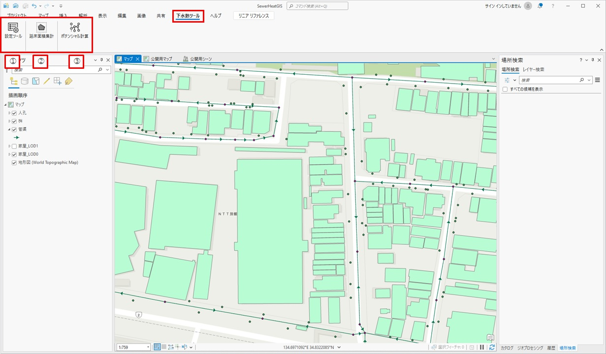

# 操作マニュアル

# 1 本書について

本書では、下水熱ポテンシャルマッチングシステム（以下「本システム」という。）の操作手順について記載しています。

# 2 使い方

## 2-1 トップ画面

本システムは「ポテンシャルマップ作成ツール」と「下水熱ツール」の２種類で構成されています。ポテンシャルマップ作成ツールは、設定ファイル「SewerHeatGIS.aprx」を起動すると以下の画面が表示されます。

①	 下水熱設定ツール

建物用途の変換、熱需要算出処理、最寄り管渠検索を実行します。

②	 延床面積集計

管渠を選択することで、選択された管渠の逓加延床面積を集計します。

③	 ポテンシャル計算

管渠の熱ポテンシャルを計算します。

下水熱ツールは、URLにてログインすると以下の画面が表示されます。

①	 拡大・縮小・２Dと３D表示の切り替え

画面の拡大・縮小及び２Dと３Dの切り替えを行えます。

②	凡例

画面上に表示されている図形の凡例を表示します。

③	下水熱ツール

下水熱ツールで利用可能な各種機能が表示されます。

## 2-2 ポテンシャルマップ作成ツール

ポテンシャルマップ作成ツールの①～③を押下することで、各種処理を実行することができます。

## 2-2-1 下水熱設定ツール

①	設定ファイル選択

・「選択」ボタンを押下するとファイル/フォルダ選択のダイアログが表示され、ダイアログの中で選択したパスがテキストボックスに入力されます。

②	 建物用途変換ファイル選択

・「選択」ボタンを押下するとファイル/フォルダ選択のダイアログが表示され、ダイアログの中で選択したパスがテキストボックスに入力されます。

③	 熱需要算出処理実行

・①及び②で設定ファイル選択を行ったうえで「熱需要算出処理実行」ボタンを押下すると、各建物に対して熱受領を算出する処理が実行されます。

④	 最寄り管渠検索処理方法

・建物に対する最寄り建物の検索方法を「建物からの距離で管渠を検索」「建物からの距離で桝を検索」の２種類から選択できます。

⑤	 最寄り管渠検索処理実行

・④で選択した方法で各建物に対する最寄り管渠を検索します。

⑥	 終了

・ダイアログを閉じます。

## 2-2-2 延床面積集計

①	設定ファイル選択

・「選択」ボタンを押下するとファイル/フォルダ選択のダイアログが表示され、ダイアログの中で選択したパスがテキストボックスに入力されます。

②	 上流側延べ床面積１

・延べ床面積を集計する対象管渠の上流側に合流してくる管渠の延べ床面積を入力することで、入力した数値を初期値として延べ床面積の集計を実行できます。（②～⑤までの４種類の合計を初期値に設定できる）

③	 上流側延べ床面積２

・延べ床面積を集計する対象管渠の上流側に合流してくる管渠の延べ床面積を入力することで、入力した数値を初期値として延べ床面積の集計を実行できます。（②～⑤までの４種類の合計を初期値に設定できる）

④	 上流側延べ床面積３

・延べ床面積を集計する対象管渠の上流側に合流してくる管渠の延べ床面積を入力することで、入力した数値を初期値として延べ床面積の集計を実行できます。（②～⑤までの４種類の合計を初期値に設定できる）

⑤	 上流側延べ床面積４

・延べ床面積を集計する対象管渠の上流側に合流してくる管渠の延べ床面積を入力することで、入力した数値を初期値として延べ床面積の集計を実行できます。（②～⑤までの４種類の合計を初期値に設定できる）

⑥	 上流延床面積値初期化

・②～⑤に入力されている値を初期化（０に戻す）します。

⑦	管渠選択

・②～⑤に入力されている値の合計を初期値として、選択した管渠から下流の管渠追跡を行い、延床面積を集計します。（管渠が分岐するか合流するまで追跡を実施し、延床面積を集計します）

⑧	終了

・ダイアログを閉じます。

## 2-2-3 ポテンシャル計算

①	設定ファイル選択

・「選択」ボタンを押下するとファイル/フォルダ選択のダイアログが表示され、ダイアログの中で選択したパスがテキストボックスに入力されます。

②	 ポテンシャル計算実行

・各管渠に対する熱ポテンシャル値を計算します。

③	終了

・ダイアログを閉じます。

## 2-3 下水熱ツール

下水熱ツールの②～⑯を押下することで、各種処理を実行することができます。

①	 処理の流れ

・下水熱ツールで実施できる処理の流れを示しています。

②	 地区絞込み（処理区）

・ここで選択した処理区内の建物、管渠、人孔だけが表示されます。

③	 検索対象選択

・下水熱を検討する対象を「空調」「給湯」から選択します。

④	 検索バッファー指定

・熱需給マッチングのうち、家屋から選択される管渠の最大バッファー値を指定できます。（最大値は150mまで）

⑤	 熱需給マッチング（家屋（1件）→管渠選択）

・ボタンを押下し、画面上で家屋を１件選択すると、家屋の熱需要値より高い熱ポテンシャル値を持ち、且つ家屋から④で指定した距離内にある管渠が強調表示されます。

⑥	 熱需給マッチング（管渠（複数可）→家屋選択）

・ボタンを押下し、画面上で管渠（複数可）を選択すると、管渠の熱ポテンシャル値より低い熱需要値を持つ家屋が強調表示されます。

⑦	 検索バッファー指定

・熱需給マッチングのうち、人孔から選択される家屋の最大バッファー値を指定できます。（最大値は150mまで）

⑧	熱需給マッチング（人孔（１件）→家屋選択→管渠（複数可）絞込）

・ボタンを押下し、画面上で人孔を１件選択し絞込用管渠をすることで、人孔の熱ポテンシャル値より低い熱需要値を持ち、且つ人孔から⑦で指定した距離内にあり、選択した管渠に関連付いている家屋が強調表示されます。

⑨	熱需要値変更

・ボタンを押下し、画面上で家屋を１件選択すると、⑰が表示されここで年間のエネルギー量を入力することで正確な熱需要値が家屋の熱需要値に入力される。

⑩	関連管渠変更

・ボタンを押下し、画面上で家屋→管渠の順で選択することで家屋に関連付く管渠が変更される。

⑪	家屋→管渠（シミュレーション対象）選択

・ボタンを押下し、画面上で家屋→管渠の順で選択することでシミュレーション対象を指定する。このボタンで対象を選択するまで、⑫～⑯はグレーアウトしている。

⑫	ヒートポンプ配置

・ボタンを押下すると、画面が３Dに切り替わり選択された家屋の熱需要値と管渠の熱ポテンシャル値で必要となるヒートポンプの大きさと同等の立体が表示される。画面上でヒートポンプを移動・回転させ設置する場所を確定後、画面右上に表示される「配置決定」を押下することでヒートポンプの設置場所を確定できる。

⑬	採熱経路作成

・ヒートポンプから採熱対象となる人孔までの経路を画面上で入力し、採熱経路を確定させる。

⑭	検討ツール作成

・選択した家屋、管渠、作成したヒートポンプ、採熱経路、③で選択した検討対象などより「下水熱利用可能性簡易検討ツール」に数値を入力した結果のExcelを圧縮（ZIP形式）したデータをダウンロードできる。

⑮	調書作成

・選択した家屋、管渠の各種情報や検討した位置画像挿入した「下水熱利用調書」をPDF形式でダウンロードできる。

⑯	初期化

・選択した家屋、管渠、作成したヒートポンプ、採熱経路の初期化を行います。

⑰	熱需要換算値入力画面

・正しい熱需要を入力する際に、各値を入力すると熱需要に換算し家屋の属性に格納できる。

# 3 出力データ

解析・シミュレーション機能で出力されるデータは以下のとおりです。

  | 機能                 | 出力データ                               | 内容                                                                                                   | データ形式 |
| -------------------- | ---------------------------------------- | ------------------------------------------------------------------------------------------------------ | ---------- |
| 検討ツール作成  | 下水熱利用可能性簡易検討ツール    | 選択した家屋、管渠、作成したヒートポンプ、採熱経路、選択した検討対象などを「下水熱利用可能性簡易検討ツール」に入力したデータ            | Microsoft Excelを圧縮したZIP    |
| 調書作成 | 下水熱利用調書                       | 選択した家屋、管渠の各種情報や検討した位置画像などを用いて作成した調書データ     | PDF        |

## 3-1 下水熱利用可能性簡易検討ツール

本システムでは、検討ツール作成機能から国土交通省　水管理・国土保全局下水道部作成の下水熱利用可能性簡易検討ツールに必要となる値を入力した状態でダウンロードできます。

## 3-2 下水熱利用調書

選択した家屋の情報、選択した管渠の情報、ヒートポンプのサイズ、採熱経路計画位置図を記載した調書がPDF形式で出力されます。

